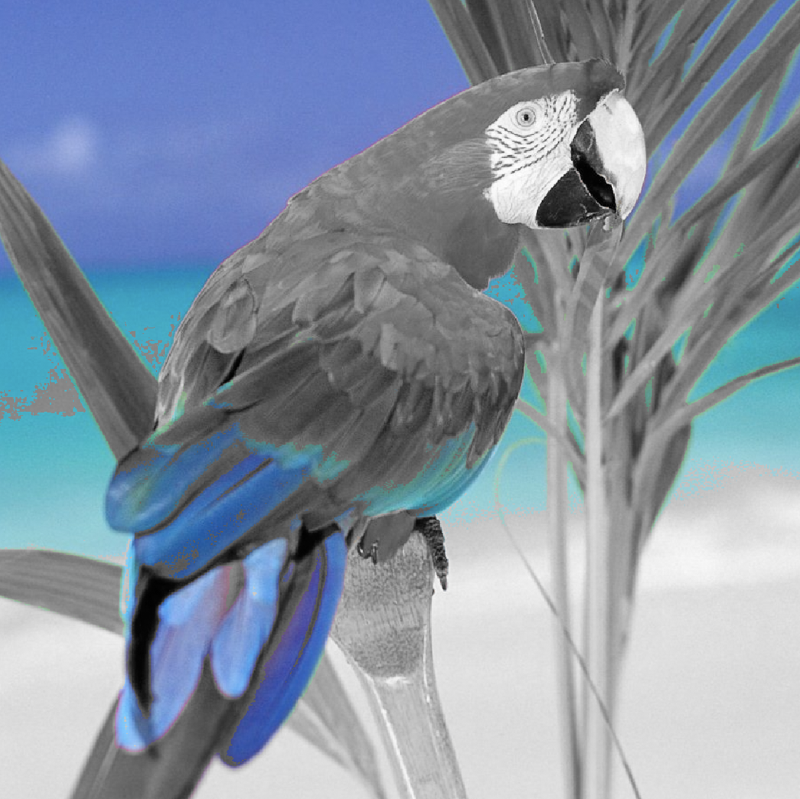

# selective-coloring
Selecting the area in the image and extract the pixel values at the given coordinates. Then, leave only this color and make all others gray.
This is done by taking the colors of an interest in a sphere and comparing each pixel with the color of interest. 

